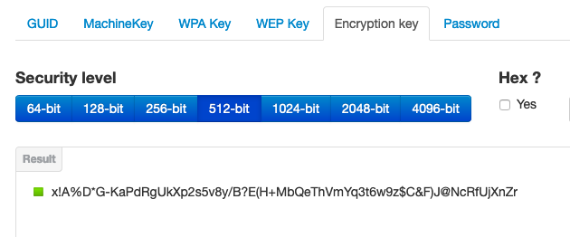
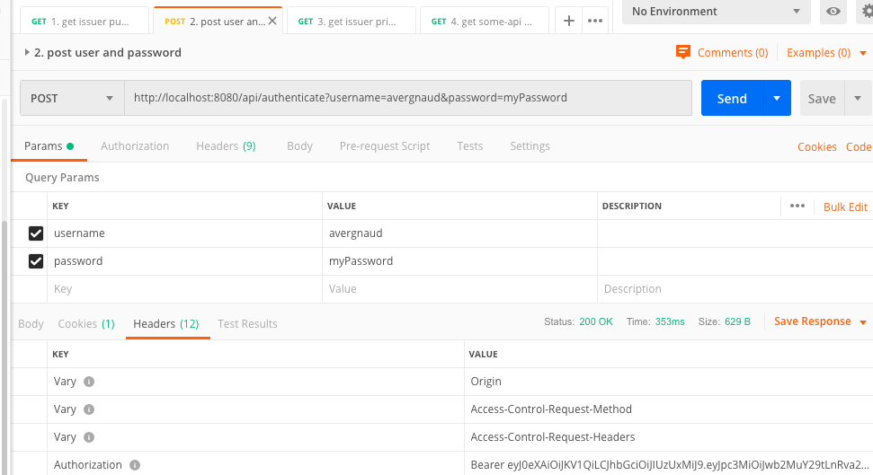

## build

Pour token-issuer et some-api :
```
mvn clean package
```

## run

[http://www.allkeysgenerator.com/](http://www.allkeysgenerator.com/)



"The JWT JWA Specification (RFC 7518, Section 3.2) states that keys used with HMAC-SHA algorithms MUST have a size >= 256 bits
(the key size must be greater than or equal to the hash output size)"

Pour token-issuer et some-api, java 8 :
```
export JWT_SECRET='...'
mvn spring-boot:run
```

## test

Avec Postman importer la collection spring-rest-security.postman_collection.json

Adapter le bearer token avec celui de votre run



## sources

[https://dev.to/keysh/spring-security-with-jwt-3j76](https://dev.to/keysh/spring-security-with-jwt-3j76)

[https://dzone.com/articles/spring-boot-security-json-web-tokenjwt-hello-world](https://dzone.com/articles/spring-boot-security-json-web-tokenjwt-hello-world)

[https://docs.spring.io/spring-security/site/docs/current/reference/html/](https://docs.spring.io/spring-security/site/docs/current/reference/html/)
